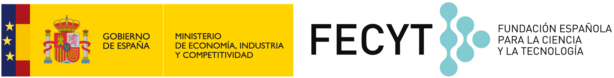

# Campus tecnológico para chicas

Repo central para
el
[Campus de Chicas 2017](http://sereingeniera.ugr.es/campus-2017). Si
estás interesada en más información o en preinscribirte, dirígete a
esa página. 

# Organización del curso

| Día | Objetivos |
|-----| --------- |
| [1](recursos/dia-1.md)   | Conocimiento mutuo. Razones por las que no se va a estudiar informática. Telegram. Conceptos de programación/interpretación usando baile/kata |
| [2](recursos/dia-2.md)   | Más conceptos de programación con baile: refactorización, depuración. Herramientas de dibujo libres. Conocimiento de Scratch |
| [3](recursos/dia-3.md)   | Narrativa de juegos o animaciones con Scratch. WoofJS. S4A/Visualino. |
| [4](recursos/dia-4.md)   | Design thinking para diseño de proyectos. Brainstorming común y por grupos. Contextos informáticos: web, chat, aplicaciones de escritorio, sistemas operativos, aplicaciones "empotradas" |
| [5](recursos/dia-5.md)   | Herramientas de trabajo en grupo: git, GitHub, Telegram+Github. Objetivos y planificación (Trello, programación ágil, reparto de tareas) |
| [6](recursos/dia-6.md)   | Comienzo del trabajo en grupo. A demanda, C para Arduino/JavaScript/AppInventor por grupos. Bots de Telegram. Introducción a las comunidades tecnológicas |
| [7](recursos/dia-7.md)   | HTML y presentaciones: uso de GitHub para publicación de páginas web. Diseño 3D y su uso en mandos de videojuegos u otros |
| [8](recursos/dia-8.md)   | Trabajo en grupo, avance de hitos en el videojuego |
| [9](recursos/dia-9.md)   | Finalización del trabajo, preparación de la presentación |
| [10](recursos/dia-10.md)  | Últimos retoques, puesta en común de cambios de actitud con respecto a la Informática, presentación y cierre | 

# Presentaciones

Presentaciones
[de los diferentes objetivos de aprendizaje a lo largo de los días del campus](https://oslugr.github.io/2017sereingeniera/dias/) 

# Proyectos

Estos son los proyectos en vía de desarrollo.

* [Videogame-project](https://github.com/ElisaChami/Videogame-Project)
* [Ponyland](https://github.com/ElisaChami/Videogame-Project)

# Quienes

[Marta](https://github.com/mgmacias95),
[Irene](https://github.com/ireneherlo),
[Celia](https://github.com/AIKUME)
y [Cristina](https://github.com/CristinaHG) serán las
monitoras. Organiza
la [OSL](http://osl.ugr.es), [Manu](http://github.com/makova) se
encarga de los sistemas y las redes sociales,
y [JJ](http://jj.github.io) coordina. 
